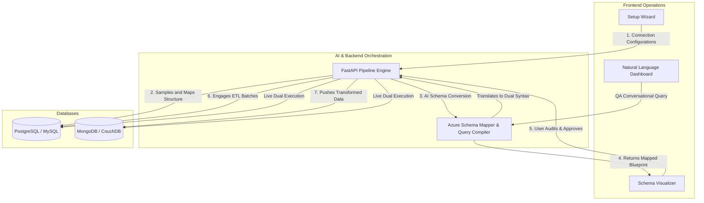

# ⚡ QueryVista: Executive Overview & Business Value

## 📖 Detailed Overview
**QueryVista** is an end-to-end Database Migration and Dual-database Intelligence platform built to drastically accelerate and de-risk data modernization strategies. Modern organizations frequently move from strictly structured relational DB systems (SQL) to scalable, document-based solutions (NoSQL). This process is notoriously risky and requires exhaustive custom scripting. 

QueryVista automates the schema-translation phase via AI. It generates comprehensive migration scripts leveraging Azure OpenAI technology, providing developers with a transparent "Human-In-The-Loop" gateway to finalize schema modifications before bulk-moving data.

After extraction and migration, the built-in **SQLAI Engine** offers an interactive Dual-DB dashboard. It allows organizational stakeholders with zero programming knowledge to query *both* databases simultaneously using plain English via generative compilation.

### 🔄 The Unified 5-Step Pipeline
1. **Source/Target Selection:** Dictate your data mapping trajectory (e.g., PostgreSQL → MongoDB).
2. **Deep Extraction:** The system natively parses strict metadata (SQL) or smartly samples collections (NoSQL) to formulate structural bounds.
3. **Transparent Review:** The application isolates 🔑 Primary Keys, 🔗 Foreign Keys, and 📇 Indices into an interactive QA dashboard so operators verify exact parameters.
4. **AI Architecture Generation:** Azure OpenAI receives the schema state and produces a JSON script blueprint for execution mapping.
5. **Data Hydration:** The ETL pipeline migrates the source data natively conforming it to the newly generated AI schema definitions.

---

## 🎯 Problem Identification
- **Massive Developer Overhead:** Engineers easily spend hundreds of hours scripting data normalization structures to fit SQL footprints into NoSQL documents.
- **Migration Black-spots:** Typical UI tools mask logic failures. Developers are unsure if data properly mapped until after the migration completes and breaks production.
- **QA Fragmentation:** Following a migration, testers must use PostgreSQL syntax, then rewrite their question entirely into MongoDB Aggregation Pipelines just to ensure identical numbers transfer across systems.

---

## 💡 The QueryVista Paradigm Shift
QueryVista serves as a **White-box, AI-Assisted Solution**:
1. **LLM Transformation:** By relying on LLMs for field mapping operations, engineering hours are slashed dramatically.
2. **Visual Approvals:** Engineers control the flow entirely. The LLM suggests, the human approves, and the system executes.
3. **Agnostic NLP Layer:** Business users can type *"How many unique users signed up last month?"*, and QueryVista securely executes it natively against *both* platforms, displaying the answers side-by-side.

---

## 🏗️ Execution Blueprint

---

## 🏢 Business & Industry Implementation
- **Agile Startups:** Teams switching product focuses who need to quickly pull data out of relational models without hiring a dedicated database administrator (DBA).
- **Quality Assurance & PM Validation:** Enabling non-technical product managers to effortlessly query data repositories post-migration to confirm the data migration didn't cause loss of business metrics.
- **Microservice Refactoring:** Splitting large monolithic PostgreSQL instances into smaller, federated MongoDB collections during enterprise software scaling.

---

## 🏆 Key Product Objectives
- Achieve **Zero-Coding ETL Transfers** through smart user interfaces and conversational agents.
- Introduce **Safe AI Integration** where LLMs dictate mappings but strict human guardrails prevent schema hallucination.
- Establish a **NoSQL/SQL Universal Bridge** standardizing semantic environments for post-migration data checking. 
